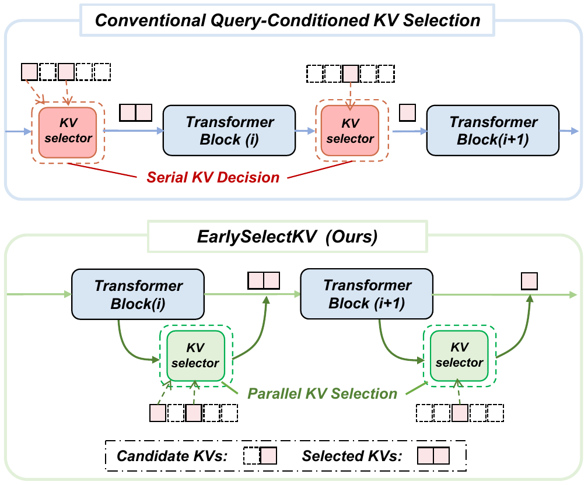
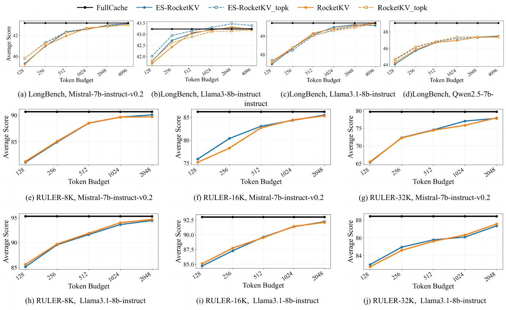

# EarlySelectKV

**Anticipatory KV Selection via Cross-Layer Query Proxies**

EarlySelectKV is a training-free transformation for query-conditioned sparse
KV selectors. It constructs a proxy query from an earlier hidden state and
precomputes the next layer's selected KV indices, while preserving the real
target-layer query for the final attention computation. The repository
includes integrations with RocketKV, Quest, Loki, and InfLLM-V2.

[Reproduction guide](docs/REPRODUCTION.md) ·
[Experiment coverage](OPEN_SOURCE_AUDIT.md) ·
[TensorRT implementation](https://github.com/sea-with-sakura/TensorRT-LLM/tree/EarlySelectKV) ·
[Figure assets](assets/figures/README.md) ·
[License](LICENSE)



## Main Idea

Conventional query-conditioned selectors must wait for a target-layer query
before producing sparse KV indices. EarlySelectKV moves this routing decision
into an earlier computation window:

1. an earlier hidden state produces a proxy query for the next layer;
2. the proxy query selects the next layer's KV pages or tokens in advance;
3. sparse attention still uses the target layer's real query and original KV
   states.

This changes when routing happens without replacing the wrapped selector's
candidate construction, scoring rule, or final attention query.

## Headline Results

Across the paper's primary quality evaluation, ES-RocketKV differs from
RocketKV by:

- **+0.018 points** on average across LongBench;
- approximately **-0.01 points** across RULER;
- **+0.25 percentage points** on the representative NIAH/Passkey settings.

The same transformation was evaluated with Quest and Loki, and the
InfLLM-V2 quality-only compatibility study reports changes of **+0.26 points**
with the exact final-checkpoint `Wq` and **-0.28 points** with its rank-256
approximation, relative to Real-Q routing.



The paper also reports up to **12.4%** higher end-to-end output throughput and
an **11.1%** reduction in GPU-resident memory for the combined KV/K-summary
pool in a TensorRT-LLM deployment with CPU-offloaded routing. The corresponding
system implementation and reproduction workflow are released separately in the
[`EarlySelectKV` branch of our TensorRT-LLM fork](https://github.com/sea-with-sakura/TensorRT-LLM/tree/EarlySelectKV).

## Artifact Scope

| This repository | Companion or external assets |
|---|---|
| LongBench, RULER, NIAH/Passkey, and MATH-500 quality evaluation | [TensorRT throughput, batching, memory, and decode-breakdown reproduction](https://github.com/sea-with-sakura/TensorRT-LLM/tree/EarlySelectKV) |
| RocketKV, Exact-TopK, Quest, Loki, and EarlySelectKV variants | Model checkpoints, generated predictions, and private credentials |
| Proxy-fidelity, ES-Mix, long-generation, low-rank, and routing-overhead analyses | InfLLM-V2 CUDA-kernel execution or timing |
| InfLLM-V2 four-task quality compatibility experiment | Training or fine-tuning code |

For the exact paper-to-code mapping and known consistency decisions, see the
[open-source audit](OPEN_SOURCE_AUDIT.md).

## Quick Start

Install a compatible PyTorch and FlashAttention build first, then run:

```bash
pip install -r requirements.txt
python scripts/dataset_prep/download_longbench.py
DRY_RUN=1 bash scripts/reproduce_paper_quality.sh
```

The dry run enumerates the paper quality matrix without loading checkpoints.
Full setup, checkpoint layout, benchmark commands, and analysis launchers are
documented in the [reproduction guide](docs/REPRODUCTION.md).

## License

Original EarlySelectKV code is released under the
[Apache License 2.0](LICENSE). Bundled RULER benchmark utilities retain their
own Apache-2.0 notice under `utils/ruler_utils/`.
